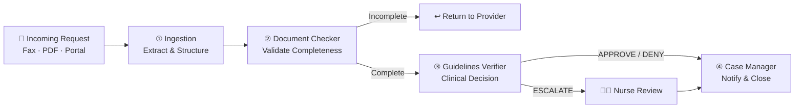
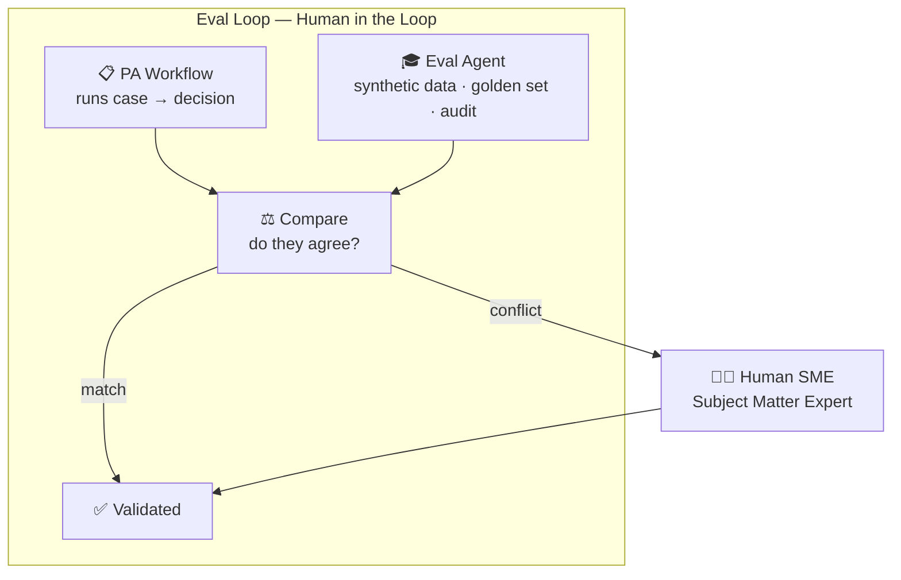

# Healthcare Agentic AI POC — Prior Authorization Operations

A rapid AI prototype demonstrating how Claude + Google ADK can automate prior authorization (PA) processing for a regional health plan.

| Time | Section | Focus |
|------|---------|-------|
| 0–2 min | §1 Problem | Business context & metrics |
| 2–5 min | §2 AI Opportunities | Four use cases |
| 5–10 min | §4 Prototype | Live Cowork demo |
| 10–12 min | §3 Quality & Compliance | CMO question answered |
| 12–15 min | §5 Extensibility | Strategic vision |

---

## 1. Problem

A regional health plan processes 15,000 PA requests per month through manual nurse review. Clinical documentation arrives via fax, PDF, portals, and uploads — creating a 4.2-day average turnaround and 22% rework rate due to missing information.

| Metric | Current | Goal |
|--------|---------|------|
| Average turnaround | 4.2 days | **2.5 days** (−40%) |
| Rework rate | 22% | **< 5%** |
| Auto-adjudication | 0% | **70–80%** |
| Provider status calls | Frequent | **Eliminated** |

---

## 2. Four AI Opportunities

### 1. Ingestion — Unstructured → Structured ← *Prototype built*
Multi-channel documentation (fax, PDF, portal, uploads) arrives in any format. AI extracts and normalizes all fields into structured JSON — eliminating manual data entry and enabling downstream automation.

### 2. Document Completeness Checker ← *Prototype built*
22% rework rate stems from missing information. AI validates each submission against treatment tier requirements and identifies missing fields with specific provider guidance — before clinical review begins.

### 3. Clinical Guidelines Verification Engine ← *Prototype built*
Manual guideline verification for 15,000 cases/month is deterministic work for routine cases. AI loads clinical guidelines, evaluates patient data, applies decision logic, and produces APPROVE / DENY / ESCALATE with a full audit trail.

Domain router pattern — each clinical specialty is a **parallel sub-agent**. Add a domain = add a folder.

| Domain | Status |
|--------|--------|
| RA Biologic | ✅ Implemented |
| Oncology / Immuno | Planned |
| Neurology | Planned |
| Diabetes / Metabolic | Planned |
| Inflammatory Bowel | Planned |

### 4. Case Manager — Workflow Automation ← *Prototype built*
Frequent provider status calls consume nurse time. AI tracks PA status through all stages, sends automated updates, handles routine inquiries, and escalates complex ones to the nurse queue.

### How the Four Opportunities Connect



---

## 3. Clinical Quality & Regulatory Compliance

*Directly addressing: "How can AI improve this process while maintaining clinical quality and regulatory compliance?"*

Each AI step carries a different hallucination risk. The design principle: push toward deterministic outputs wherever possible; escalate to human judgment where not.

| Step | Risk | Why | Mitigation |
|------|------|-----|------------|
| ① Ingestion | 🟡 Medium | Free text may be misread or incomplete | Structured JSON output is machine-verifiable; tool selection scales with complexity (RAG / VectorDB / Graph RAG) |
| ② Completeness | 🟢 Low | Rule-based checklist — no clinical judgment required | Deterministic field validation; AI confirms presence/absence only, never interprets |
| ③ Guidelines | 🔴 **Highest** | Clinical decision directly impacts patient care; SOP is complex and multi-specialty | Deterministic rules for routine cases → forced ESCALATE for ambiguous → Eval Loop + HITL for non-deterministic → Flywheel for continuous improvement |
| ④ Case Manager | 🟢 Low | Downstream of structured decisions; no independent clinical judgment | Zero independent judgment; full audit trail on every action satisfies regulatory requirements |

---

## 4. Prototype — Claude PA Pipeline

End-to-end pipeline implemented as both a **Claude Cowork Skills plugin** (runs in Claude desktop or web — no local setup required) and a **Google ADK project** (enterprise deployment path).

### Pipeline Stages

```
Raw Fax / PDF / Portal
        ↓
[1] Intake Agent        — loads scenario files into session state
        ↓
[2] Ingestion Agent     — unstructured text → structured JSON
        ↓
[3] Document Checker    — completeness validation (✅ / ⚠️ / ❌)
        ↓
[4] Guidelines Verifier — domain router → clinical criteria → decision
        ↓
[5] Case Manager        — provider letter + decision saved to output/
```

### Demo Scenarios (6 cases)

| Scenario | Patient | Drug | Expected Decision |
|----------|---------|------|-------------------|
| scenario-1-auto-approve | Sandra Whitfield | Humira | APPROVE |
| scenario-2-incomplete   | Marcus Webb      | Ozempic | INCOMPLETE → return to provider |
| scenario-3-auto-deny    | Priya Sharma     | Remicade | DENY (CRP below threshold) |
| scenario-4-escalate     | David Fontaine   | Keytruda | ESCALATE (PD-L1 ambiguous) |
| scenario-5-sla-risk     | James Holloway   | IVIG | AT RISK (25h remaining) |
| scenario-6-queue-summary | — | — | Queue dashboard |

### Run the Demo

**Claude Cowork (recommended):** Open the `pa-poc` project in Claude desktop or claude.ai → switch to Cowork → paste any prompt from [`DEMO-PROMPTS.md`](.claude/skills/prior-authorization/runs/DEMO-PROMPTS.md)

**ADK (Python):**
```bash
cd adk_pa && pip install -e . && python run_pa.py scenario-1-auto-approve demo-run-01
```

---

## 5. Extensibility

### ① Eval Loop with Human-in-the-Loop



- **Before the loop** — deterministic rule-based cases are excluded upfront. This loop targets only context-based decisions where AI judgment needs validation.
- **Inside the loop** — PA Workflow and Eval Agent run the same case in parallel, like AB testing. If they agree, the case is validated. If they conflict, it escalates to the Human SME.
- **Beyond the loop** — in production, real cases feed into BigQuery automatically, turning this loop into a self-improving flywheel. No manual curation needed.
- Status: designed + built, not yet connected to live systems.

### ② Knowledge Wiki — Living Business Rules
Clinical staff update rules in plain English — no engineer needed, no model retraining required. Rules live as versioned files; AI agents pick them up at runtime. Clinical knowledge stays current without touching the model.
- Status: designed + built, not yet connected to live wiki

### ③ Plugin Marketplace — Shareable & Reusable
Any team can discover and deploy this pipeline with one prompt — no setup required. Published live and searchable. Other health plan teams can install and run immediately.
- Status: **live** — published at https://fmlin0429712024.github.io/ai-pdlc-marketplace/

### ④ Google ADK — Enterprise Deployment Path
Same pipeline mirrored as a Google ADK project using Gemini 2.5 Pro on Vertex AI. Business rules are identical in both. Switching is an infrastructure decision — no business logic changes. Enterprise features: IAM auth, Cloud Logging, auto-scaling, HIPAA-eligible BAA.
- Status: designed + built, not yet deployed to cloud

---


## 6. Tech Stack

| Layer | Prototype | Production Path |
|-------|-----------|-----------------|
| AI Model | Claude Sonnet (Anthropic API) | Gemini 2.5 Pro (Vertex AI) |
| Orchestration | Claude Code CLI (Skills Plugin) | Google ADK SequentialAgent |
| Business Rules | Plain-English rules files | Rules files → internal wiki |
| State | In-memory (prototype) | Cloud Firestore |
| Auth | Local credentials | Google Cloud IAM + VPC |
| Compliance | — | HIPAA BAA (Google Cloud) |

---
